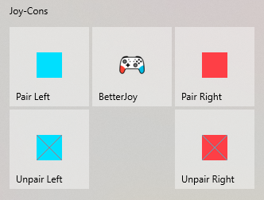

# Joy-Con Connection Helpers
## About
With [BetterJoy](https://github.com/Davidobot/BetterJoy) it is possible to use the Nintendo Switch Joy-Cons for games and emulators running on Windows. Connecting the Joy-Cons is a bit cumbersome as you have to pair them every time you want to use them (or at least I have to do that). I created tiny helper scripts to pair and unpair a left and right Joy-Con.

### Start Menu

It is possible to create shortcuts to them and pin those to the start menu. I also provided some incredible icons if you want a little bit of color.

## Requirements
You have to install the 'Bluetooth Command Line Tools' for this to work:
https://bluetoothinstaller.com/bluetooth-command-line-tools

## Notes
I don't know if this works if you want two additional Joy-Cons (a third and fourth one) as I only have two. But I could imagine that it still works, as the reported bluetooth device names that are used are the same.
